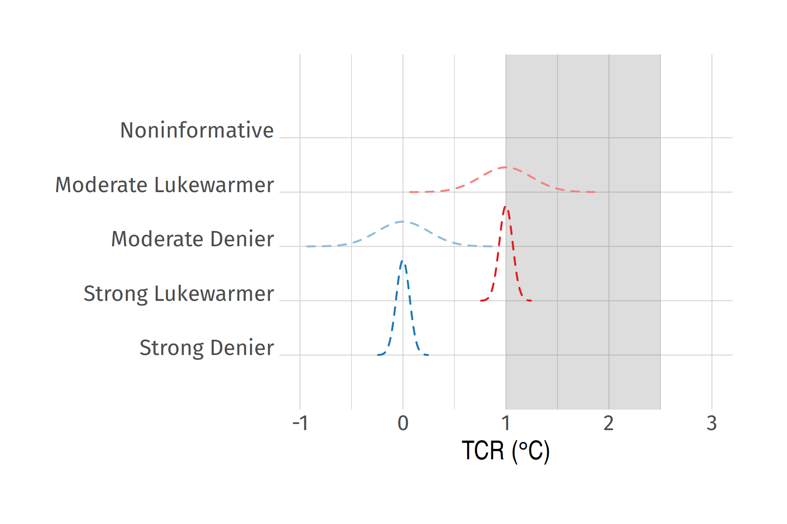
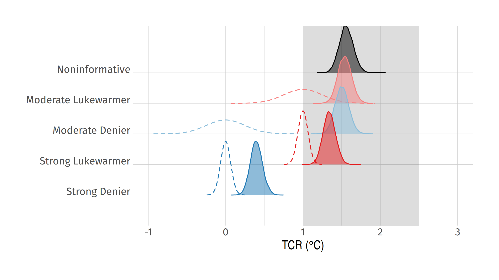
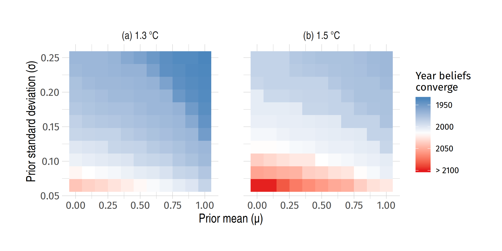
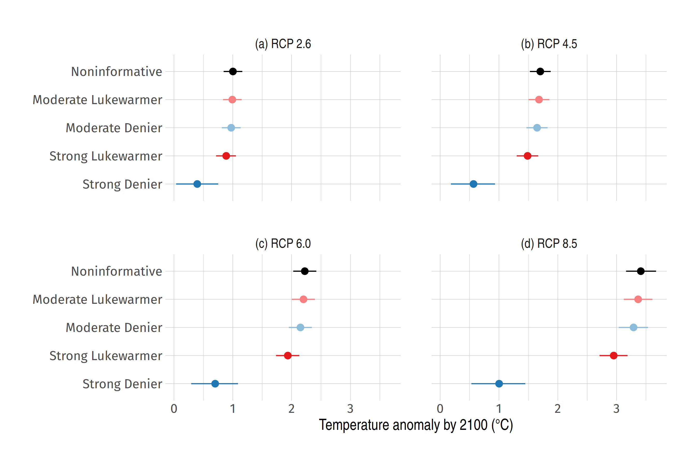
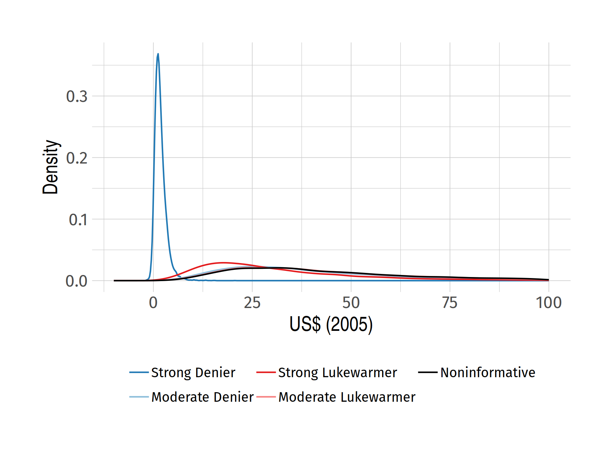
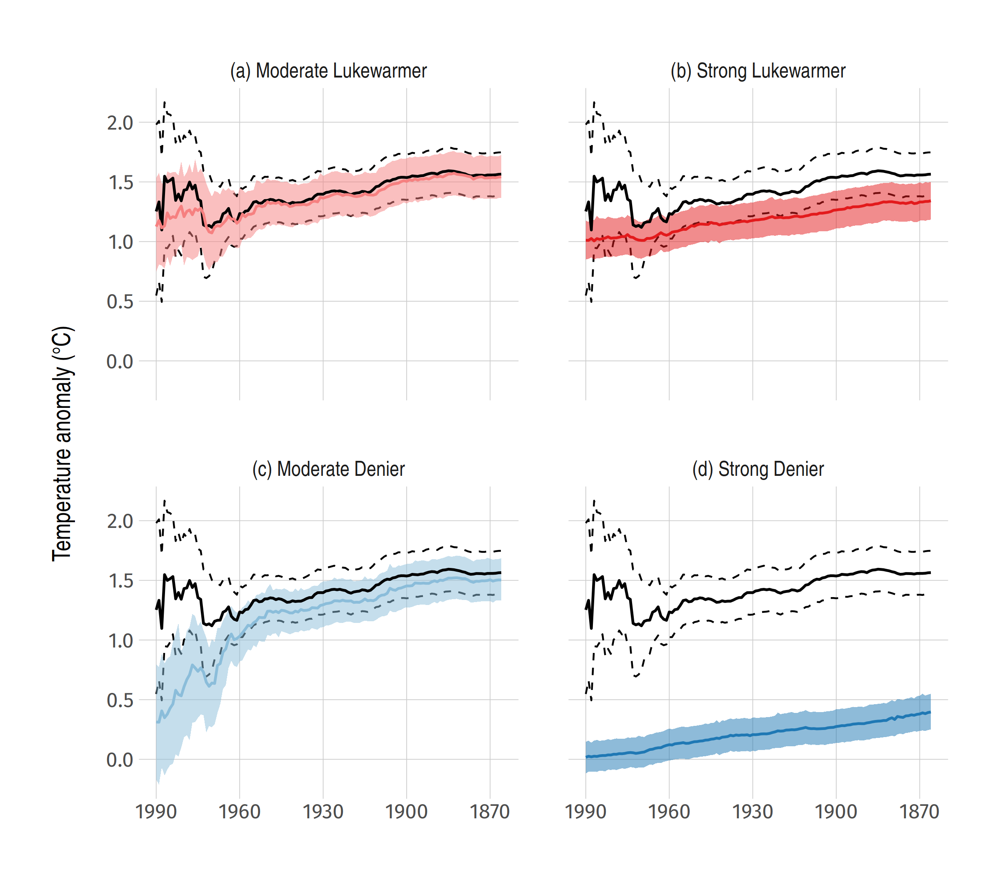

```{css, echo=FALSE}
# CSS for including pauses in printed PDF output (see bottom of lecture)
@media print {
  .has-continuation {
    display: block !important;
  }
}
.large4 { font-size: 400% }
.large2 { font-size: 200% }
.small90 { font-size: 90% }
.small75 { font-size: 75% }
```

```{r setup, include=FALSE}
options(htmltools.dir.version = FALSE)
library(knitr)
opts_chunk$set(
  fig.align = "center",  
  fig.height = 4, #fig.width = 6,
  # out.width = "748px", #out.length = "520.75px",
  dpi = 300, #fig.path = 'figs/',
  cache = TRUE#, echo = F, warning = F, message = F
  )

library(RefManageR)
BibOptions(check.entries = FALSE, bib.style = "numeric", cite.style = "numeric", 
           style = "markdown", dashed = TRUE)
bib = ReadBib("scepticpriors.bib")
```

```{r libs, cache=FALSE}
```

# Table of contents

1. [Prologue](#prologue)

2. [Introduction](#intro)

3. [Framework](#metrics)

4. [Results](#results)

5. [Conclusions](#conclusions)

6. [References](#refs)

---
class: inverse, center, middle
name: prologue

# Prologue

---

# Where to find this all

Paper: https://grantmcdermott.com/papers/scepticpriors.pdf

Code: https://github.com/grantmcdermott/sceptic-priors

Slides: https://github.com/grantmcdermott/reed-erws

--

</br>

Or, if you're ~~a masochist~~ on Twitter: [@grant_mcdermott](https://twitter.com/grant_mcdermott)

---
class: inverse, center, middle
name: intro

# Introduction

---

# Motivation

In the beginning, there were climate blogs.


--

</br>
</br>
Instead of arguing, maybe write a paper about it?

---

# Big picture

> How much evidence would it take to convince climate sceptics that they are wrong?

--

### Approach: Bayesian framework
- Combine real climate data with a (plausible) range of stylised sceptics.
- Simple statistical approach rather than a complicated GCM.

--

### Key takeaways

- Available evidence overwhelms all but the most extreme priors.
- However, convergence with the mainstream is non-linear. Gets harder and harder to convince the "marginal" sceptic.

--

I also argue that a generalised Bayesian model provides a bridge between competing theories of climate scepticism.

---

# Background

Comprehensive climate policy remains elusive.
- Many policy makers and citizens remain sceptical, despite overwhelming scientific consensus `r Citep(bib, c('oreskes2004beyond', 'cook2013quantifying', 'cook2016consensus', 'saad2019americans'))`
- Especially true in the US.

Lots of research on the cultural and psychological drivers of climate scepticsm. `r Citep(bib, c('kahan2011cultural', 'kahan2012polarizing', 'hornsey2016meta'))`
- Two main schools of thought: 1) cultural cognition VS 2) information deficit.
- (I'll return to this later.)

--

### This paper

Not so much concerned with the origins of scepticism as its _implications_.
- How much evidence do we need to change the minds of sceptics?
- Sounds like we need some Bayes up in here...

---

# Beliefs about climate sensitivity

A convenient way to model sceptic beliefs is by defining them in terms of _climate sensitivity_, i.e. the temperature response to a doubling of CO<sub>2</sub>.

I focus on **TCR** (transient climate response). According to the IPCC `r Cite(bib, 'ipcc2013i')`: 

--

.pull-left[
- TCR is "likely" in the range of 1.0–2.5 °C.
]

.pull-right[
```{r, echo=FALSE, out.width="75%", fig.cap="[Source](https://www.ipcc.ch/report/ar5/wg1/technical-summary/)"}
knitr::include_graphics("https://www.ipcc.ch/site/assets/uploads/2018/02/FigTS_TFE.6-2-687x1024.jpg")
```
]

---
count: false

# Beliefs about climate sensitivity

A convenient way to model sceptic beliefs is by defining them in terms of _climate sensitivity_, i.e. the (probabilistic) temperature response to a doubling of CO<sub>2</sub>.

I focus on **TCR** (transient climate response). According to the IPCC `r Cite(bib, 'ipcc2013i')`: 


.pull-left[
- TCR is "likely" in the range of 1.0–2.5 °C.
- TCR is an inherently Bayesian concept.
]

.pull-right[
> *"[T]he probabilistic estimates available in the literature for[...] TCR have all been based, implicitly or explicitly, on adopting a Bayesian approach and therefore, even if it is not explicitly stated, involve using some kind of prior information."* (p. 922)
]

---
count: false

# Beliefs about climate sensitivity

A convenient way to model sceptic beliefs is by defining them in terms of _climate sensitivity_, i.e. the (probabilistic) temperature response to a doubling of CO<sub>2</sub>.

I focus on **TCR** (transient climate response). According to the IPCC `r Cite(bib, 'ipcc2013i')`: 


.pull-left[
- TCR is "likely" in the range of 1.0–2.5 °C.
- TCR is an inherently Bayesian concept.
]

</br></br></br></br></br></br></br></br></br></br>


<b>_tl;dr_</b> Sceptic beliefs can be presented as a distributions of TCR. Any "learning" about the true value of TCR will be constrained by someone's initial beliefs.

---

# Previous literature

Main differences from previous work stems from a combination of:

--

### 1. Explicit focus on climate sceptics
- Although, I'll also use a "noninformative" prior to construct a reference TCR distribution.
- Related: `r Cite(bib, c('kelly1999learning', 'wijnbergen2015skeptics', 'kiseleva2016heterogeneous'))`, etc.

--

### 2. Use of Bayesian time-series regression
- Much research on the non-stationarity of climate data (😢), but recent work convincingly argues that these are best described as trend-stationary processes with common structural breaks (😃).
- Related: `r Cite(bib, c('gay2009global', 'estrada2013statistically', 'tol1998bayes'))`, etc.

---
class: inverse, center, middle
name: metrics

# Econometric framework

---

# Bayesian regression

Estimate probable value of a set of parameters $\theta$, given data $X$:

$$p(\theta|X) = \frac{p(X|\theta)p(\theta)}{p(X)}$$
--

where

- $p(\theta|X)$ is the *posterior*. ("What are the probable values of our parameters, given the data?")
- $p(X|\theta)$ is the *likelihood*. ("How likely are the data given a set of parameters?")
- $p(\theta)$ is the *prior*. ("What do know about the parameters before we see the data?")

--

The final $p(X)$ term in the denominator is the marginal probability of the data. Since this just acts as a normalisation constant (and be calculated *ad hoc*), we typically re-write as...

---

# Bayesian regression (cont.)

Estimate probable value of a set of parameters $\theta$, given data $X$:

$$p(\theta|X) \propto p(X|\theta)p(\theta)$$
</br>
> "The posterior is proportional to the likelihood times the prior"


--

</br>

Looks simple enough, but (with a few exceptions) it is impossible to solve for the posterior analytically. Fortunately, we can [solve algorithmically](https://github.com/grantmcdermott/sceptic-priors) using MCMC software (JAGS, BUGS, Stan, etc.)

--

Let's put these pieces together for the current problem.

---

# Likelihood function

Following `r Cite(bib, c('estrada2012breaks', 'tol1998bayes'))`, I model global temperatures as

$$
  GMST_t = \alpha_0 + \beta_1RF_t + \gamma_2VOLC_t + \delta_3SOI_t + \eta_4AMO_t + \epsilon_t
$$

where

- $GMST$ ~ global mean surface temperature
- $RF$ ~ radiative forcing (CO<sub>2</sub>, solar, etc.)
- $VOLC$ ~ volcanic aerosols
- $SOI$ ~ Southern Oscillation Index (i.e. ENSO)
- $AMO$ ~ Atlantic Multidecadal Oscillation
- $\epsilon_t = \phi \epsilon_{t-1} + \nu_t$ ~ AR(1) error process

$t$ runs from 1866 to 2005 (historic data) and then up to 2100 (climate scenarios).

---

# Likelihood (cont.)

$$
  GMST_t = \alpha_0 + \beta_1RF_t + \gamma_2VOLC_t + \delta_3SOI_t + \eta_4AMO_t + \epsilon_t
$$

Getting from $\beta$ to TCR is a simple matter of multiplying it by the change in forcing that results from a doubling of CO<sub>2</sub>.

$$\text{TCR} = \beta_1 \cdot F_{2\times}$$

where I use the IPCC's best estimate of $F_{2\times}=3.71 \text{ Wm}^{-2}$.

--

</br></br>
**Aside:** Have to combine both anthropogenic and natural forcings in composite $RF$ term, because defined i.t.o of same units (i.e. Wm<sup>-2</sup>). 
- Separating them out risks (a) severe multicollinearity or (b) model becoming unphysical... Although I still do this as a robustness check it has no effect on the main results.


---

# Priors

Define a typology of four basic sceptics, based on their beliefs about TCR. (A noninformative prior will serve as a reference case.)



---
class: inverse, center, middle
name: results

# Results

---

# TCR


--

**Bottom line:** Only the hardcore strong denier doesn't converge after seeing all the evidence.

---

# TCR (live updating)


--
name: gif

*Sorry, I know I didn't set the animation up carefully (fixed ratio, etc.) [Here](#recursive) is a still of the recursive estimates if you prefer.*

---

# How much evidence would it take?


--

**Takeaway:** If you aren't convinced by the available data today, you probably won't be convinced for many years hence. (Increasingly hard to convince the marginal sceptic.)

---

# Future temps and SCC



---

# Future temps and SCC (cont.)



---

# Bayes as a bridge

In the paper, I return to the _origins_ of climate scepticism.

I argue that a generalised Bayesian framework is able to accommodate competing theories about why climate scepticism exists (persists?) the first place.
- "Cultural cognition" vs "information deficit"

**Key idea:** Incorporate beliefs about source credibility &mdash; e.g. how trustworthy do I find the IPCC? &mdash; that moderates the learning effect of any new information.

---
class: inverse, center, middle
name: conclusions

# Conclusions

---

# Conclusions

### Research question

How much evidence would it take to convince climate sceptics that they are wrong?

### Framework

Bayesian model combining a range of plausible priors and actual climate data.

### Findings

1. Most subjective priors are overwhelmed by the empirical evidence for climate change.

2. However, convergence with the mainstream is a nonlinear function of prior strength. Increasingly hard to convince the marginal sceptic, so if you aren't persuaded already...

3. Bayes can provide a *lingua franca* between competing theories of climate scepticism as a social phenomenon.

---

# Thanks!

Paper: https://grantmcdermott.com/papers/scepticpriors.pdf

Code: https://github.com/grantmcdermott/sceptic-priors

Slides: https://github.com/grantmcdermott/reed-erws

---
class: inverse, center, middle
name: refs

# References

---

# References

.small75[
```{r, results='asis', echo=FALSE, cache=FALSE}
PrintBibliography(bib, start = 1, end = 7)
```
]

---

# References (cont.)

.small75[
```{r, results='asis', echo=FALSE, cache=FALSE}
PrintBibliography(bib, start = 8, end = 14)
```
]

---
name: recursive

# Recursive TCR estimates

```{r, echo=FALSE, out.width="70%"}

```

[Go back.](#gif)


```{r gen_pdf, include = FALSE, cache = FALSE, eval = FALSE}
pagedown::chrome_print("slides.html", output = "slides.pdf")
```